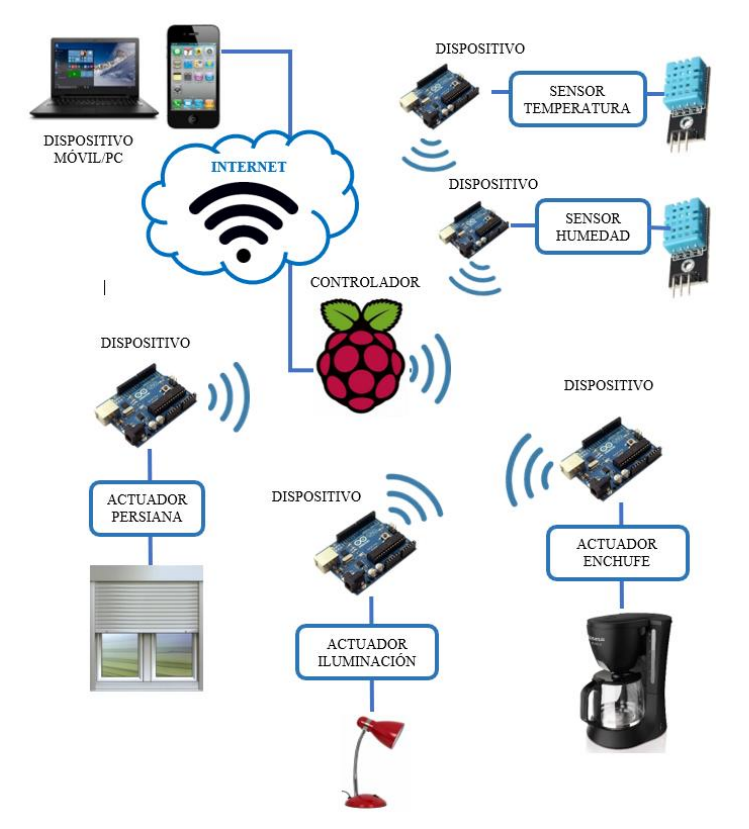
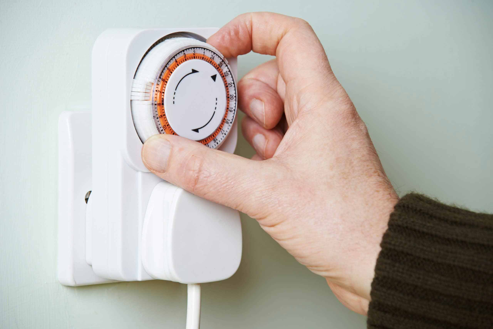

# Documentación proyecto Aether
## 1. Nombre, diseño y colores del logo de la aplicación (Sprint 1):
El proyecto se titula *Aether* (Éter en latín), esta palabra hace referencia a un elemento el cual permea todo el universo, permitiendo que espectros que necesitan de un medio para desplazarse como la luz puedan ser explicados a partir de ese concepto (Tomado de: [Wikipedia](https://es.wikipedia.org/wiki/%C3%89ter_(elemento))).

El motivo de la selección de este nombre se debe a que el proyecto consiste en comunicar dispositivos de automatización por medio de una aplicación a través de wifi, tal como el éter es un medio de propagación lo mismo ocurre con el wifi, puesto que este es medio de transmisión de comunicación y de datos, de ahí su relación con el proyecto.

Por otra parte el diseño de la aplicación consiste en una ambientación espacial, puesto que es allí donde se manifiesta el éter, para esta representación se utilizan los colores negro, blanco y azul claro, el color negro interpreta el vacío en el espacio y añade estética y serenidad a la aplicación, el color blanco es aplicado al logo de la aplicación, el cual es una estrella de neutrones, esto con el fin de representar un elemento del espacio, por último, el azul claro expresa seguridad y fiabilidad, además que brida valor estético al combinarlo con los colores mencionados (Tomado de: [GraciAds](https://graciads.com/significado-de-colores-en-marketing/#:~:text=Negro,Chanel%2C%20Adidas%20y%20Louis%20Vuitton.)).

## Antecedentes:

* El siguiente proyecto plantea la necesidad de crear un sistema de arquitectura domótica dado el problema de que los sistemas ya creados por distintas empresas someten a los usuarios a solo poder utilizar aquellos dispositivos creados por ellos, negando la posibilidad de poder adaptar dichos sistemas a otros distintos mediante código abierto, convirtiendo aquellos productos en sistemas cerrados, por ello, este proyecto busca crear su propio sistema basado en la tipología estrella, es decir, que los dispositivos enlazados pueden ser controlados mediante una misma aplicación y a su vez garantizar la menor intrusión posible contra el usuario.
   
   El sistema propuesto utiliza una conexión de tipo estrella la cual es encabezada por un controlador, en este caso, una Raspberry Pi, el cual es el nucleo del sistema, a este se conectarán otros controlodarores pero que actuaran como dispositivos de conexión, en este caso, Arduino, por medio de la señal que reciban desde Raspberry, estos dispositivos envían ordenes a los sensores y actuadores a los que estaran conectados, así mismo los dispositivos rebirán información que recopilen estos últimos acerca del estado de su ambiente y su funcionamiento. 
   
   (Tomado de: [Diseño e implementación de una arquitectura para hogar digital](https://oa.upm.es/53096/1/TFG_JOAQUIN_PEREZ_MORALES.pdf)).

* El proyecto consiste en el diseño de un sistema domótico integral, versátil y
personalizable, utilizando plataformas de desarrollo convencionales como controlador y servidor, enlazándolos con sensores y actuadores físicos mediante protocolos de comunicación y de internet para, de esta manera, controlar tantos dispositivos en la vivienda se desee, a través del sistema eléctrico, sanitario y mecánico de la misma. Además, se recopilará data del consumo energético de los dispositivos para la óptima gestión de los recursos y se llevará el registro mediante una interfaz gráfica anclada al sistema de control. Dicha interfaz es completamente personalizable y estéticamente atractiva, lo que genera un valor agregado al servicio (Tomado de: [Diseño e implementación de un
sistema domótico utilizando plataformas de desarrollo como controlador](https://repositorio.ulima.edu.pe/bitstream/handle/20.500.12724/8026/La_Cruz_Chac%C3%B3n_Jonat%C3%A1n?sequence=3)).

## ¿En qué consiste el proyecto?

Este proyecto esta enfocado a a automatizar electrodomésticos que no cuentan con estas tecnologías, es decir, equipos obsoletos en el mercado, véase licuadoras, microondas, entre otros. Para realizarlo se plantea utilizar un timer el cual se pueda integrar a la alimentación de cada electrodoméstico permitiendo controlar el flujo de corriente, así mismo se plantean utilizar sensores que permitan determinar la temperatura de cada electrodoméstico, estos estarán conectados al timer, y este estará vinculado por medio de wifi a un dispositivo movil, en donde por medio de una aplicación se podrá establecer comunicación entre el usuario y los electrodomésticos a controlar.

## Protocolos de comunicación:

* **Protocolo MQTT**: Es un protocolo de mensajería basado en reglas, que se utiliza para la comunicación de un equipo a otro. Los sensores inteligentes, los dispositivos portátiles y otros dispositivos de Internet de las cosas (IoT) generalmente tienen que transmitir y recibir datos a través de una red con recursos restringidos y un ancho de banda limitado. Estos dispositivos IoT utilizan MQTT para la transmisión de datos, ya que resulta fácil de implementar y puede comunicar datos IoT de manera eficiente. 

   Para ello un cliente MQTT establece una conexión con el agente MQTT, una vez conectado, el cliente puede publicar mensajes, suscribirse a mensajes específicos o hacer ambas cosas, cuando el agente MQTT recibe un mensaje, lo reenvía a los suscriptores que están interesados (Tomado de: [Amazon](https://aws.amazon.com/es/what-is/mqtt/#:~:text=El%20protocolo%20MQTT%20define%20un,admitir%20tambi%C3%A9n%20el%20protocolo%20WSS.)).

* **Protocolo Zigbee**: Es un conjunto de protocolos de comunicación inalámbrica que permite la creación de redes de área personal (PAN, Personal Area Network) y se caracteriza por su reducido consumo energético y baja tasa de envío de datos. Una de las principales ventajas que presenta es su reducido consumo de energía. (Tomado de: [EfectoLED](https://www.efectoled.com/blog/es/que-es-zigbee/#:~:text=Zigbee%20es%20un%20conjunto%20de,tasa%20de%20env%C3%ADo%20de%20datos.)).

## Automatización del sistema:

Dado que el caso de uso principal de la aplicación es controlar electrodomésticos de forma remota, es indispensable automatizarlos, esto es posible por medio de la implementación de un timer, este dispositivo es capaz de controlar el flujo de energía de un electrodoméstico, actualmente, en su versión digital tiene una pantalla LED y botones que permiten su configuración y ligado a ello al controlar la energía que consumen los electrodomésticos, permite ahorrar en la factura de luz. 

Este dispositivo elimina la necesidad de usar el modo stand by, que también consume energía, ademas de ello ofrece tranquilidad, ya que permite apagar cualquier aparato eléctrico, aun cuando una persona no está en casa. Asimismo, logra que el uso de los electrodomésticos sea más eficiente.

(Tomado de: [Verisure](https://www.verisure.com.ar/blog/temporizador-enchufes-como-funciona-ventajas-y-desventajas#:~:text=Un%20temporizador%20enchufe%20es%20un,tan%20solo%20programar%20su%20configuraci%C3%B3n.)).
## Bases de datos:

Para este proyecto es indispensable la implementación de una base de datos, puesto que se pretende almacenar los datos que recopilen los dispositivos para poder brindarle al usuario recomendaciones de uso de sus electrodomésticos. Existen herramientas que permiten crear bases de datos como el caso de *Firebase*, esta herramienta no solo permite crear y almacenar bases de datos sino que además permite desarrollar aplicaciones en ella. (Tomado de [Wikipedia](https://es.wikipedia.org/wiki/Firebase)).

## Entorno de programación:

Para crear una aplicación es escencial tener en cuenta el entorno de programación donde se va a desarrollar la misma, para ello, se propone el uso de *Android Studio*, esta herramienta se caracteriza por contar con un potente editor de códigos y multitud de funciones que permiten una mayor productividad durante el desarrollo de la aplicación. También ofrece un flexible sistema de compilación, un emulador de gran rapidez y herramientas para identificar problemas de compatibilidad, rendimiento o usabilidad. (Tomado de: [Scoreapps](https://scoreapps.com/blog/es/android-studio/#:~:text=Ventajas%20de%20Android%20Studio&text=Ejecuta%20la%20aplicaci%C3%B3n%20en%20tiempo,visualizarlas%20en%20un%20mismo%20entorno.)).

## Marco legal:

Respecto a la normatividad a la que se encuentra expuesta el proyecto se encuentran involucrados los derechos de logo y marca, donde desde el punto de vista de la propiedad intelectual, es posible entrar a analizar aquellas vías de carácter jurídico establecidas para la protección de estos bienes intangibles, respecto de las cuales se estudiarán en el presente acápite, tomando como punto de referencia la familia de los signos distintivos, específicamente lo que la ley y la jurisprudencia han sabido denominar marca.

Así, pues, de conformidad con lo establecido por el artículo 134 de la Decisión 486 del 14 de septiembre del 2000 emanada de la Comisión de la Comunidad Andina, una marca se encuentra definida como "[…] cualquier signo que sea apto para distinguir productos o servicios en el mercado (Tomado de: [Aplicaciones móviles: protección jurídica desde el ámbito de la propiedad intelectual](https://revistas.uexternado.edu.co/index.php/propin/article/view/5777/7597)).

## Desarrollo del proyecto (Sprint 2):

Para el desarrollo del proyecto de creó un diagrama de clases el cual permitiría dimensionar la estructuración de toda la programación, tanto de la aplicación como del dispositivo a implementar en los electrodomésticos.


Además de ello se creó un diagrama de casos de uso, el cual nos permitiría dimensionar los alcances que la aplicación le podría brindar al usuario.


### Desarrollo de la aplicación:

Para este Sprint se enlazó la aplicación a la base de datos de Firebase y se crearon las clases necesarias para crear el registro, login, creación de horarios y sistema de notificaciones. El programa se divide en 4 clases principales llamadas MainActivity, registroActivity, LoginActivity y CrearHorarioActivity.

- #### Clase MainActivity:

   Esta clase alberga los botones de interacción de la aplicación, como lo son el botón de añadir horario, cerrar sesión y crear notificación.

``` java

public class MainActivity extends AppCompatActivity {
    private Button btn_notificacion;
    private PendingIntent pendingIntent;
    private final static String CHANNEL_ID = "Notificación";
    private final static int NOTIFICACION_ID = 0;
    Button btn_add, btn_logout;
    FirebaseAuth mAuth;


    @Override
    protected void onCreate(Bundle savedInstanceState) {
        super.onCreate(savedInstanceState);
        setContentView(R.layout.activity_main);

        mAuth = FirebaseAuth.getInstance();


        btn_add = findViewById(R.id.btn_add);
        btn_logout = findViewById(R.id.btn_cerrar);
        btn_notificacion = findViewById(R.id.btn_notificacion);


        btn_add.setOnClickListener(new View.OnClickListener() {
            @Override
            public void onClick(View view) {
                startActivity(new Intent(MainActivity.this, CrearHorarioActivity.class));
            }
        });

        btn_logout.setOnClickListener(new View.OnClickListener() {
            @Override
            public void onClick(View view) {
                mAuth.signOut();
                finish();
                startActivity(new Intent(MainActivity.this, LoginActivity.class));
            }
        });

        btn_notificacion.setOnClickListener(new View.OnClickListener() {
            @Override
            public void onClick(View view) {
                createNotificationChannel();
                createNotification();
            }
        });
    }

    private void createNotificationChannel() {
        if(Build.VERSION.SDK_INT >= Build.VERSION_CODES.O) {
            CharSequence name = "Aether";
            NotificationChannel notificationChannel = new NotificationChannel(CHANNEL_ID, name, NotificationManager.IMPORTANCE_DEFAULT);
            NotificationManager notificationManager = (NotificationManager) getSystemService(NOTIFICATION_SERVICE);
            notificationManager.createNotificationChannel(notificationChannel);
        }
    }

    private void createNotification() {
        NotificationCompat.Builder builder = new NotificationCompat.Builder(getApplicationContext(), CHANNEL_ID);
        builder.setSmallIcon(R.drawable.notilogo_3p_24);
        builder.setContentTitle("Aether");
        builder.setContentText("Esta es una notificación de prueba");
        builder.setColor(Color.GREEN);
        builder.setPriority(NotificationCompat.PRIORITY_DEFAULT);
        builder.setLights(Color.RED, 1000, 1000);
        builder.setVibrate(new long[]{1000, 1000, 1000, 1000});
        builder.setDefaults(Notification.DEFAULT_SOUND);
        NotificationManagerCompat notificationManagerCompat = NotificationManagerCompat.from(getApplicationContext());
        if (ActivityCompat.checkSelfPermission(this, android.Manifest.permission.POST_NOTIFICATIONS) != PackageManager.PERMISSION_GRANTED) {
            return;
        }
        notificationManagerCompat.notify(NOTIFICACION_ID, builder.build());
    }
}
```

- #### Clase registroActivity:

   En esta clase se encuentra la creación del botón de registro el cual contiene las llaves y valores (Map) de la información de registro de usuario como lo son ID, nombre, correo y contraseña, para que el posterior guardado de esta información sea efectivo se invocan los métodos proporcionados por Firebase para enlazar la aplicación con la base de datos.

``` java

public class CrearHorarioActivity extends AppCompatActivity {

    Button btn_AddH;
    EditText nombre, horaInicio, horaFin;
    private FirebaseFirestore mfirestore;

    @Override
    protected void onCreate(Bundle savedInstanceState) {
        super.onCreate(savedInstanceState);
        setContentView(R.layout.activity_crear_horario);

        mfirestore = FirebaseFirestore.getInstance();

        nombre = findViewById(R.id.Nombre);
        horaInicio = findViewById(R.id.HoraOn);
        horaFin = findViewById(R.id.HoraOff);
        btn_AddH = findViewById(R.id.btn_AddH);

        btn_AddH.setOnClickListener(new View.OnClickListener() {
            @Override
            public void onClick(View view) {
                String nombreElec = nombre.getText().toString().trim();
                String horaInicioelec = horaInicio.getText().toString().trim();
                String horaFinelec = horaFin.getText().toString().trim();

                if(nombreElec.isEmpty() && horaInicioelec.isEmpty() && horaFinelec.isEmpty()) {
                    Toast.makeText(getApplicationContext(), "Ingrese los datos requerridos", Toast.LENGTH_SHORT).show();
                }else {
                    afterHorario(nombreElec, horaInicioelec, horaFinelec);
                }
            }
        });

    }

    private void afterHorario(String nombreElec, String horaInicioelec, String horaFinelec) {
        Map<String, Object> map = new HashMap<>();
        map.put("Electrodomestico", nombreElec);
        map.put("Hora_de_inicio",horaInicioelec);
        map.put("Horario_de_finalizacion", horaFinelec);
        mfirestore.collection("Horario").add(map).addOnSuccessListener(new OnSuccessListener<DocumentReference>() {
            @Override
            public void onSuccess(DocumentReference documentReference) {
                Toast.makeText(getApplicationContext(), "Creado exitosamente", Toast.LENGTH_SHORT).show();
                finish();
            }
        }).addOnFailureListener(new OnFailureListener() {
            @Override
            public void onFailure(@NonNull Exception e) {
                Toast.makeText(getApplicationContext(), "Error al ingresar", Toast.LENGTH_SHORT).show();
            }
        });
    }

    @Override
    public boolean onSupportNavigateUp() {
        onBackPressed();
        return false;
    }
}
```
